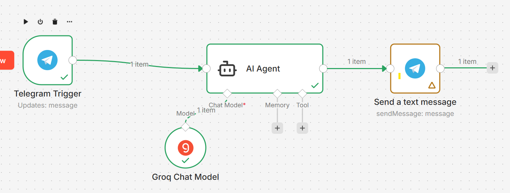

# 🚗 Telegram AI Bot - Number Plate OCR (n8n + AI Agent)

This project is a simple automation workflow built using **n8n** that allows a Telegram bot to extract vehicle number plate text from images using AI.

---

## 📌 Features

- 📷 Send a car number plate image via Telegram
- 🤖 AI Agent processes the image
- 🔍 Extracts number plate text (OCR)
- 📩 Returns only the detected text

---

## 🛠️ Tech Stack

- n8n (Workflow Automation)
- Telegram Bot API
- Groq Chat Model (LLaMA / Mixtral)
- AI Agent Node

---

## ⚙️ Workflow Overview

1. Telegram Trigger receives user message
2. AI Agent processes the input
3. Groq model analyzes the content
4. Extracted number plate is sent back to user

---

## 🖼️ Workflow Screenshot

---
